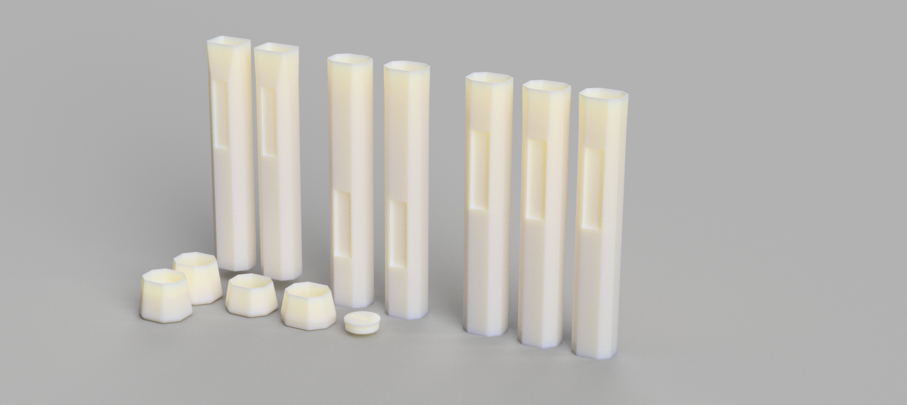

# Custom pallets and buttcaps for tennis racquet customization

## 3d printable pallets/buttcaps for some popular racquets (ezone98, vcore95, ultraTour v2)

This project was born from the rabbit-hole that is tennis racquet customization. I have designed fully 3d-printable pallets for some of my racquets in order to try new sizes and shapes. For example, what if you like yonex sticks but prefer a head handle shape? Or you found a great deal on a racquet only to find out the handle size won't suit you. This project seeks to solve those problems, granted the process is relatively labour intensive. The designed pallets should work with any yonex or wilson frames since the hairpin is the same across all SKU's (except wilson clash), however the throat fit may be sub optimal for unsupported frames (any frame other than ezone98, vcore95 and ultratour v2). 

## Printing instructions

Use CF nylon or CF pc only. One wall and 12% infill is sufficient with these filaments. PLA will need at least 3 walls for sufficient strength thereby increasing weight substantially. Print vertically. Cartesian bed-slingers will require slower speeds to minimize vibration at height. 

## Guide

1. Use a utility knife to remove all the pallet foam from the handle. The goal is to expose the graphite hairpin. This is very easy with Wilson frames because they are rectangular. Yonex frames will be a struggle because the hairpin has some curvature. The foam will also have metal weights embedded; make sure to clean these, the printed pallets have inserts for them. 

2. Although the friction fit on the hairpin is fairly strong, put a couple dabs of superglue on the hairpin before installation. Do the same on the pallet for buttcap installation. Superglue the metal weights in place. 
